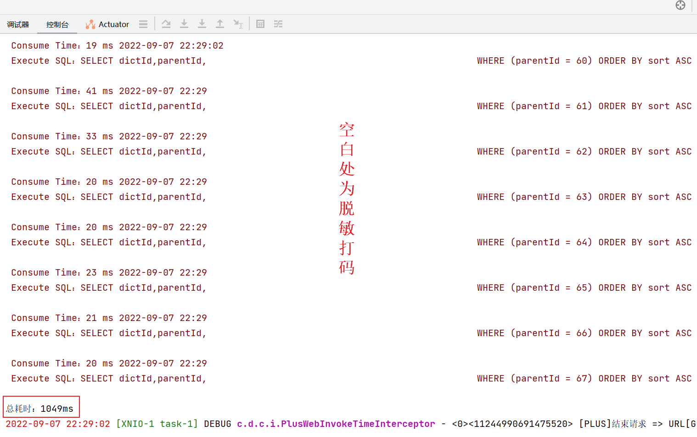

# 递归查询树型结构数据的性能优化方案

**C：** 在日常开发中，像系统菜单、文件目录、多级分类这样的树型结构业务数据，我们往往会采用递归的方式来完成数据的查询处理。  

递归查询数据的确很方便，但稍微不注意就会造成较大的性能损耗，今天笔者就简单介绍一种优化方案。

<!-- more -->

## SQL递归查询方案

::: tip 查询思路
1. SQL 查询一级数据
2. 遍历一级数据
3. 通过一级数据 **递归** SQL 查询二级...等子级数据
:::

```java {13,23,39,47}

/**
 * 根据字典码查询树型字典
 *
 * @param code 字典码
 * @return 树型字典
 */
public List<KeyValueItemVo> listDictTreeByCode(String code) {
    // #####开始计时#####
    TimeInterval timer = DateUtil.timer();
    
    // 1、获取一级字典
    List<SysDict> oneLevelDictList = this.listDictByCodeAndParentId(code, null);
    if (CollUtil.isEmpty(oneLevelDictList)) {
        return null;
    }

    // 2、遍历一级字典
    List<KeyValueItemVo> resultList = new ArrayList<>();
    oneLevelDictList.forEach(oneLevelDict -> {
        KeyValueItemVo result = new KeyValueItemVo(oneLevelDict.getDictKey(), oneLevelDict.getDictValue());
        // 3、递归获取子级字典
        result.setItems(getChildren(oneLevelDict.getDictId()));
        resultList.add(result);
    });
    
    // #####打印计时#####
    System.out.println("总耗时：" + timer.interval() + "ms");
    return resultList;
}

/**
 * 根据父ID查询子字典树
 *
 * @param parentId 父ID
 * @return 子字典树
 */
private List<KeyValueItemVo> getChildren(Long parentId) {
    List<SysDict> children = this.listDictByCodeAndParentId(null, parentId);
    if (CollUtil.isEmpty(children)) {
        return null;
    }

    List<KeyValueItemVo> resultList = new ArrayList<>();
    children.forEach(child -> {
        KeyValueItemVo result = new KeyValueItemVo(child.getDictKey(), child.getDictValue());
        result.setItems(getChildren(child.getDictId()));
        resultList.add(result);
    });
    return resultList;
}

/**
 * 根据字典码和父ID查询字典列表
 *
 * @param code     字典码
 * @param parentId 父ID
 * @return 字典列表
 */
public List<SysDict> listDictByCodeAndParentId(String code, Long parentId) {
    LambdaQueryWrapper<SysDict> queryWrapper = Wrappers.<SysDict>lambdaQuery()
        .eq(StrUtil.isNotBlank(code), SysDict::getCode, code)
        .orderByAsc(SysDict::getSort);
    if (parentId == null) {
        queryWrapper.isNull(SysDict::getParentId);
    } else {
        queryWrapper.eq(SysDict::getParentId, parentId);
    }
    return dictMapper.selectList(queryWrapper);
}
```

这种方式执行后，控制台打印了好几屏幕的查询 SQL，而且层级越深，每级的数据越多，产生的 SQL 查询也会越多，程序的执行效率自然就会很低。



## 程序递归处理方案

既然发现了问题，那就要想办法进行优化。而性能优化除了要学治本外还要善用治标，方案一效率低的原因是由于产生了过多的 SQL 查询，对症下药自然就要减少 SQL 查询次数。

::: tip 优化查询思路
1. SQL 查询出所有数据
2. 在程序中对数据进行整理
   1. 过滤出一级数据
   2. 遍历一级数据
   3. 通过一级数据 **递归** 过滤二级...等子级数据
   :::

```java {12-15,21-23,28,45-47,55}
/**
 * 根据字典码查询树型字典
 *
 * @param code 字典码
 * @return 树型字典
 */
public List<KeyValueItemVo> listDictTreeByCode(String code) {
    // #####开始计时#####
    TimeInterval timer = DateUtil.timer();
    
    // 1、获取所有字典列表
    LambdaQueryWrapper<SysDict> queryWrapper = Wrappers.<SysDict>lambdaQuery()
        .eq(SysDict::getCode, code)
        .orderByAsc(SysDict::getSort);
    List<SysDict> dictList = dictMapper.selectList(queryWrapper);
    if (CollUtil.isEmpty(dictList)) {
        return null;
    }

    // 2、获取一级字典
    List<SysDict> oneLevelDictList = dictList.stream()
        .filter(dict -> Objects.isNull(dict.getParentId()))
        .collect(Collectors.toList());
    List<KeyValueItemVo> resultList = new ArrayList<>();
    oneLevelDictList.forEach(oneLevelDict -> {
        KeyValueItemVo result = new KeyValueItemVo(oneLevelDict.getDictKey(), oneLevelDict.getDictValue());
        // 3、递归整理子级字典
        result.setItems(getChildren(oneLevelDict.getDictId(), dictList));
        resultList.add(result);
    });
    
    // #####打印计时#####
    System.out.println("总耗时：" + timer.interval() + "ms");
    return resultList;
}

/**
 * 根据父ID查询子字典树
 *
 * @param parentId 父ID
 * @param dictList 所有该类型子字典数据
 * @return 子字典树
 */
private List<KeyValueItemVo> getChildren(Long parentId, List<SysDict> dictList) {
    List<SysDict> children = dictList.stream()
        .filter(dict -> Objects.isNotNull(dict.getParentId()) && dict.getParentId().equals(parentId))
        .collect(Collectors.toList());
    if (CollUtil.isEmpty(children)) {
        return null;
    }

    List<KeyValueItemVo> resultList = new ArrayList<>();
    children.forEach(child -> {
        KeyValueItemVo result = new KeyValueItemVo(child.getDictKey(), child.getDictValue());
        result.setItems(getChildren(child.getDictId(), dictList));
        resultList.add(result);
    });
    return resultList;
}
```

优化查询后，我们再来看一下执行效果，控制台仅打印了一条查询 SQL，程序执行效率也有了很大的提升。


::: details 涉及的 VO 类结构

```java
/**
 * 单级键值对VO
 *
 * @author Charles7c
 * @date 2022/9/7 21:23
 */
@Data
@NoArgsConstructor
@AllArgsConstructor
@Accessors(chain = true)
public class KeyValueVo {
    /**
     * 文本
     */
    private Object label;
    /**
     * 值
     */
    private Object value;
}
```

```java
/**
 * 多级键值对VO
 *
 * @author Charles7c
 * @date 2022/9/7 21:23
 */
@Data
@NoArgsConstructor
@Accessors(chain = true)
@EqualsAndHashCode(callSuper = true)
public class KeyValueItemVo extends KeyValueVo {

    /**
     * 子项
     */
    @JsonInclude(JsonInclude.Include.NON_EMPTY)
    private List<KeyValueItemVo> items;

    public KeyValueItemVo(Object label, Object value, List<KeyValueItemVo> items) {
        super(label, value);
        this.items = items;
    }

    public KeyValueItemVo(Object label, Object value) {
        super(label, value);
    }
}
```
:::