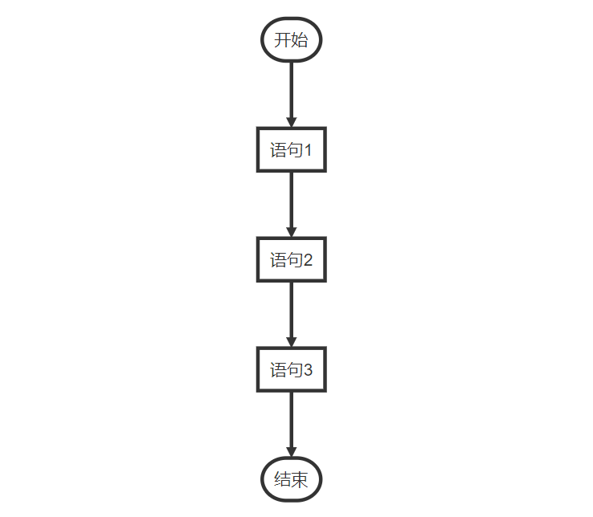
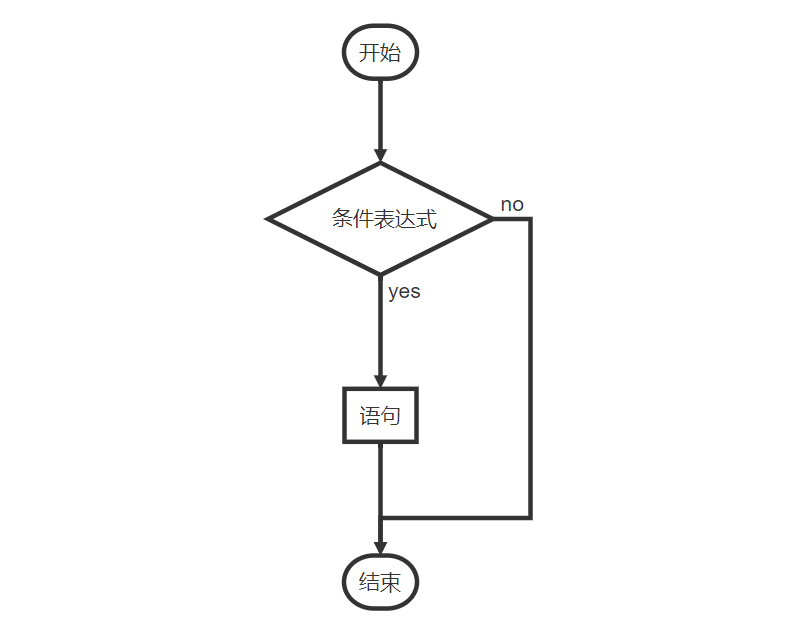
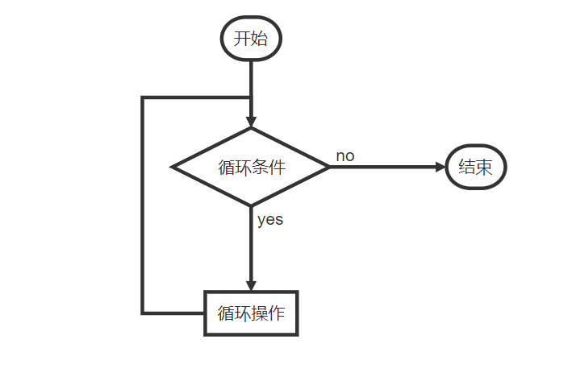
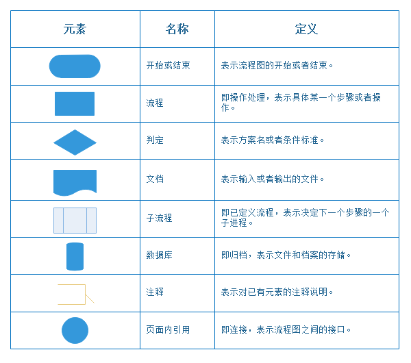
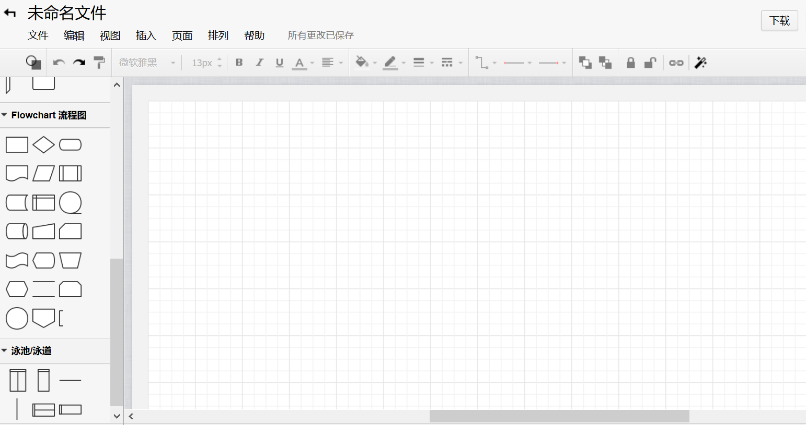
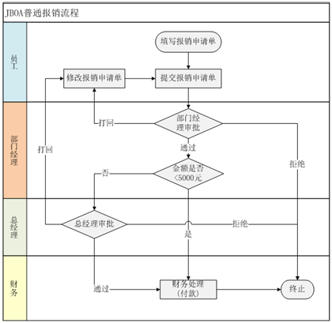

# 控制语句和流程图

## 前言

**C：** 现实生活中，我们每天都要面对各种选择，有句俗话叫" **选择比努力更重要** "，不同选择所对应的结果千差万别。在程序中编写的代码也是如此，我们上篇学到的关系运算符、逻辑运算符就可以让程序执行不同的选择。

而且对于初级的应用开发者（码农），未来每天的工作就是用本篇的选择结构写业务逻辑，所以它们学起来也不难，因为经常要使用啊！

在介绍 Java 中的选择结构语法前，笔者先带你在本篇介绍一下程序中常见的流程控制语句。

<!-- more -->

## 概述

在前几篇的学习中，我们也写了几行代码，而且也明白编写的代码是自上而下依次执行下来的，编写几行，就会自上而下执行几行。这种"一根筋"的代码被称为 **顺序控制语句**  。


## 顺序控制语句

**顺序控制语句** 是程序中最简单的流程控制，按照代码执行的先后顺序，依次执行，程序中的大多数代码都是这样执行的。[1]

<!-- flowchart 格式
```flow
st=>start: 开始
process1=>operation: 语句1
process2=>operation: 语句2
process3=>operation: 语句3
e=>end: 结束

st->process1->process2->process3->e
```
-->

<!-- flowchart 格式 图

-->

```mermaid
flowchart LR
    A([开始]) --> B[语句1]
    B --> C[语句2]
    C --> D[语句3]
    D --> E([结束])
```

## 选择控制语句

本篇我们要学习的选择结构就属于 **选择控制语句** 。 **选择控制语句** 也被称为分支结构语句，选择结构有特定的语法规则，代码要执行具体的逻辑运算进行判断，逻辑运算的结果有两个或多个（真或假），所以产生了选择，根据不同的选择就会执行不同的代码。[1]

<!-- flowchart 格式
```
st=>start: 开始
cond=>condition: 条件表达式
process=>operation: 语句
e=>end: 结束

st->cond
cond(yes)->process->e
cond(no)->e
```
-->

<!-- flowchart 格式 图

-->

```mermaid
flowchart LR
    A([开始]) --> B{条件表达式}
    B -->|是| C[语句]
    C --> D
    B -->|否| D([结束])
```

## 循环控制语句

循环控制语句可以在满足循环条件的情况下，反复执行某一段代码，这段被重复执行的代码被称为循环体语句（循环操作）。当反复执行这个循环体时，需要在合适的时候把循环判断条件修改为 false ，从而结束循环，否则循环将一直执行下去，形成死循环。[1]

<!-- flowchart 格式
```
st=>start: 开始
cond=>condition: 循环条件
process=>operation: 循环操作
e=>end: 结束

st->cond
cond(yes)->process(left)->cond
cond(no)->e
```
-->

<!-- flowchart 格式 图

-->

```mermaid
flowchart LR
    A([开始]) --> B{循环条件}
    B -->|是| C[循环操作]
    C --> B
    B -->|否| D([结束])
```

## 流程图

### 概述

你看上方的控制语句，笔者每个都配有一个简单图示，这种图示叫流程图。以后的程序逻辑越来越复杂，我们就可以通过流程图，用图示的方式，来反映出特定主体为了满足特定需求而进行的，有特定逻辑关系的一系列操作过程（程序步骤）。

::: tip 什么是流程图？
流程图是对过程、算法、流程的一种图像表示，在技术设计、交流及商业简报等领域有广泛的应用。通常用一些图框来表示各种类型的操作，在框内写出各个步骤，然后用带箭头的线把它们连接起来，以表示执行的先后顺序。用图形表示算法，直观形象，易于理解。有时候也被称之为输入-输出图。顾名思义，就是用来直观地描述一个工作过程的具体步骤。这种过程既可以是生产线上的工艺流程，也可以是完成一项任务所必需的管理过程。  

一张简明的流程图，不仅能促进产品经理与设计师、开发者的交流，还能帮助我们查漏补缺，避免功能流程、逻辑上出现遗漏，确保流程的完整性。流程图能让思路更清晰、逻辑更清楚，有助于程序的逻辑实现和有效解决实际问题。  

通常，对于任何希望创建流程的人来说，无论创建的是什么用的流程，流程图都是很有用的。它可以帮你：  

1. 设计你产品的交互流程
2. 确保的你的产品在任何时候都是友好的（甚至包括你原来根本未曾考虑过的故障发生时）
3. 帮助你整合零散的线框图
4. 帮助你与不同背景的同事进行沟通：比如引导工程师开发[2]
:::


### 图示

为便于识别，绘制流程图的习惯做法是：

- 圆角矩形：表示开始与结束
- 矩形：表示操作步骤、用于普通工作环节
- 菱形：表示问题判断（审核/审批/评审）环节
- 平行四边形：表示输入和输出
- 箭头：代表工作流方向




流程图中有这么多符号，想要更好更快的绘制，我们可以使用一些流程图绘制工具！例如微软的 `visio` 或是直接使用在线流程图绘制网站：[Process On](https://www.processon.com/)（使用挺顺手，就是容量小，免费用户只能创建9张图，想新建更多，要么充钱要么导出图后删除一些无用的，记得删除后再进入回收站内删除，否则也会占用容量）、还有 [亿图](https://www.edrawsoft.cn/) 也可以使用。



### 示例

例如：公司报销的流程，特定主体是员工，特定需求是报销，特定逻辑关系是员工报销过程中的一系列操作。下方是某办公自动化系统的报销业务流程设计图。



### 注意事项

1. 绘制流程图时，为了提高流程图的逻辑性，应遵循从左到右、从上到下的顺序排列，而且可以在每个元素上用阿拉伯数字进行标注。
2. 从开始符开始，以结束符结束。开始符号只能出现一次，而结束符号可出现多次。若流程足够清晰，可省略开始、结束符号。
3. 当各项步骤有选择或决策结果时，需要认真检查，避免出现漏洞，导致流程无法形成闭环。
4. 处理符号应为单一入口、单一出口。
5. 连接线不要交叉。
6. 如果两个同一路径的下的指示箭头应只有一个。
7. 相同流程图符号大小需要保持一致。
8. 处理为并行关系，可以放在同一高度。
9. 必要时应采用标注，以此来清晰地说明流程。
10. 流程图中，如果有参考其他已经定义的流程，不需重复绘制，直接用已定义流程符号即可。

## 参考文献

[1]文泷Vincent. 流程控制语句—顺序、选择、循环[EB/OL]. https://blog.csdn.net/qq_34236718/article/details/80596376. 2018-06-06

[2]edraw 亿图. 什么是流程图？看完你就明白了！[EB/OL]. https://www.edrawsoft.cn/what-is-flowchart/. 2021-01-08

## 后记

我们即将进入选择结构的学习，意味着我们要开始编写稍微灵活的程序，这时候大家要注意自己的逻辑思维训练。如果无法在脑海中构建一个比较好的空间思维图，那就老实的画画流程图，然后再写程序，绝对是有用的！！！

::: info 笔者说
对于技术的学习，笔者一贯遵循的步骤是：先用最最简单的 demo 让它跑起来，然后学学它的最最常用 API 和 配置让自己能用起来，最后熟练使用的基础上，在空闲时尝试阅读它的源码让自己能够洞彻它的运行机制，部分问题出现的原因，同时借鉴这些技术实现来提升自己的代码高度。

所以在笔者的文章中，前期基本都是小白文，仅仅穿插很少量的源码研究。当然等小白文更新多了，你们还依然喜欢，后期会不定时专门对部分技术的源码进行解析。
:::
