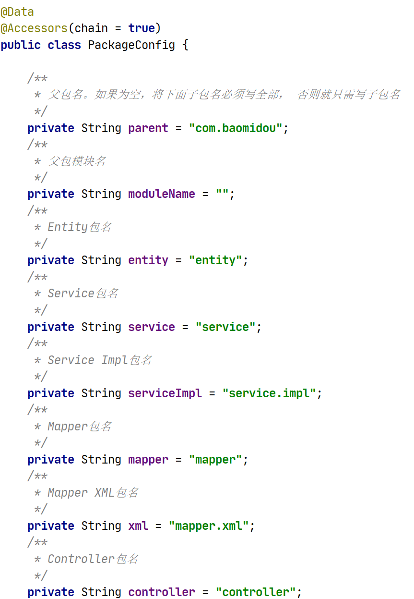
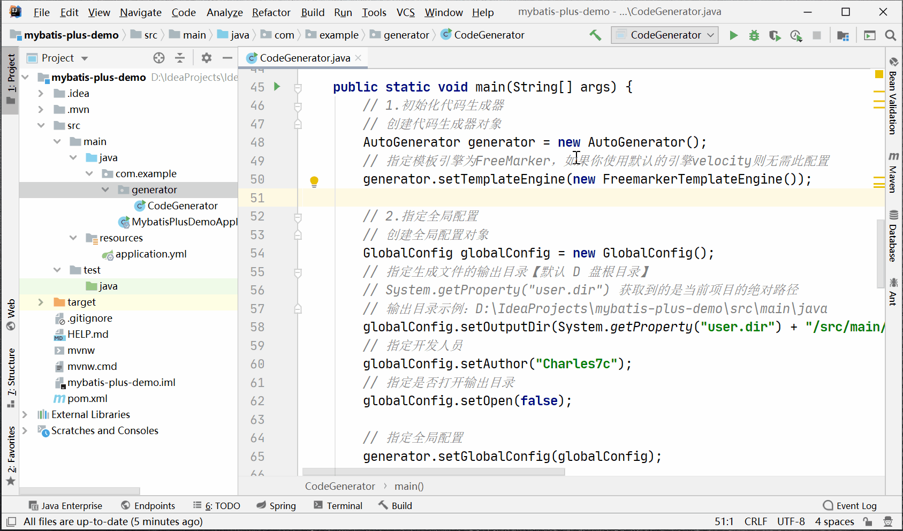
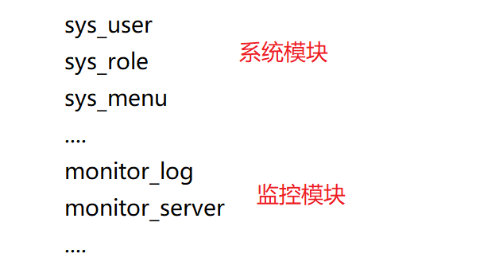
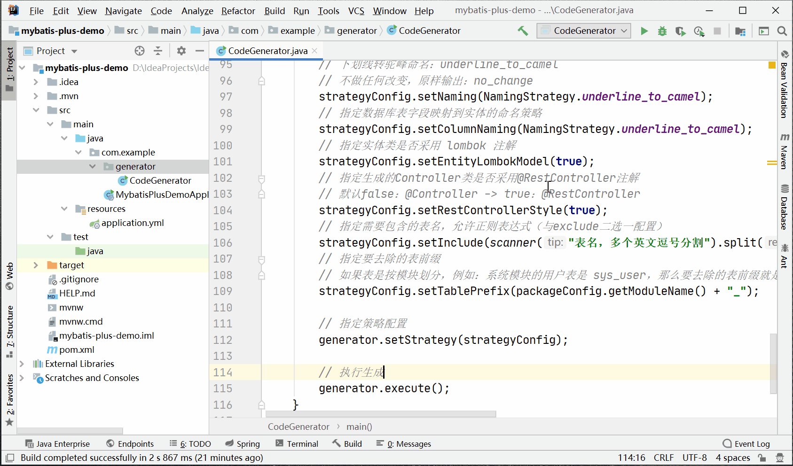

# 代码生成器

## 前言

**C：** 做了程序员之后，你就会发现自己再也看不得一些繁琐重复的东西，尤其是写代码的时候。

“好麻烦！这样写工作效率太低了吧！”

“写这么多冗余代码干嘛？提出来不好吗？”

....

开玩笑的说，程序员这个岗位诞生之后，最终的目标就是 “取代同行，取悦自己，公司再取代你”。


为了 “取悦” 自己（简化大量的重复工作量），各种自动化或生成工具应运而生，解决重复代码方面最为典型的就是代码生成器了。

本篇，笔者就主要带你认识一下 MP 自带的代码生成器。

## 简介

::: tip 笔者说
MP 诞生的目的就是为了简化 MyBatis，但简化后依然有些部分有重复性，这时候可以靠 MP 提供的一个代码生成器：AutoGenerator 来解决。  

通过 AutoGenerator 可以快速生成 Entity、Mapper、Mapper XML、Service、Controller 等各个模块的代码，极大的提升了开发效率。[1]
:::

## 使用步骤

为了测试 MP 的代码生成器，记得提前将之前项目备份一下，这样我们就可以清空掉原来项目代码，然后使用 MP 的代码生成器来对之前数据库进行代码生成了。

### 添加依赖

MP 从 `3.0.3` 之后移除了代码生成器与模板引擎的默认依赖[1]，所以，当我们需要使用代码生成器时，需要先添加一下这两个依赖。

```xml
<!-- 代码生成器 依赖 -->
<dependency>
    <groupId>com.baomidou</groupId>
    <artifactId>mybatis-plus-generator</artifactId>
    <version>3.4.1</version>
</dependency>

<!-- 模板引擎 依赖 -->
<dependency>
    <groupId>org.freemarker</groupId>
    <artifactId>freemarker</artifactId>
    <version>2.3.31</version>
</dependency>
```

::: tip 笔者说
笔者这里选择的模板引擎是 freemarker，它是 Apache 开源的一个知名模板技术。  

另外，MP 也支持 Velocity（默认）、Beetl，你可以选择自己熟悉的模板引擎，如果都不满足要求，也可以采用自定义模板引擎。[1]
:::

### 创建入口类

添加好依赖之后，创建一个生成器入口类，就可以开始使用 MP 的代码生成器了。

```java
/**
 * MyBatis Plus 代码生成器入口类
 * 执行 main 方法控制台输入模块表名回车自动生成对应项目目录中
 *
 * @author Charles7c
 * @since 2021/1/28
 */
public class CodeGenerator {

    public static void main(String[] args) {
        
    }

}
```

### 编写配置

MP 的代码生成器提供了大量的自定义配置参数供用户选择，能够满足绝大部分人的使用需求[1]，接下来，我们在 `main` 方法中配置一下生成器。

第一步：初始化代码生成器。

```java
// 创建代码生成器对象
AutoGenerator generator = new AutoGenerator();
// 指定模板引擎为FreeMarker，如果你使用默认的引擎velocity则无需此配置
generator.setTemplateEngine(new FreemarkerTemplateEngine());
```

第二步：指定全局配置。

```java
// 创建全局配置对象
GlobalConfig globalConfig = new GlobalConfig();
// 指定生成文件的输出目录【默认 D 盘根目录】
// System.getProperty("user.dir") 获取到的是当前项目的绝对路径
// 输出目录示例：D:\IdeaProjects\mybatis-plus-demo\src\main\java
globalConfig.setOutputDir(System.getProperty("user.dir") + "/src/main/java");
// 指定开发人员
globalConfig.setAuthor("Charles7c");
// 指定是否打开输出目录
globalConfig.setOpen(false);

// 指定全局配置
generator.setGlobalConfig(globalConfig);
```

第三步：指定包名配置，通过该配置，指定生成代码的包路径。

```java
// 创建包配置对象
PackageConfig packageConfig = new PackageConfig();
// 指定父包名
packageConfig.setParent("com.example");

// 指定包名配置
generator.setPackageInfo(packageConfig);
```

::: tip 笔者说
仅指定父包名就可以，MP 指定好了子包名。看看它的源码吧，实体类的包名默认是 `entity`，业务类的包名默认是 `service` ...
:::




第四步：指定数据源配置，通过该配置，指定需要生成代码的具体数据库。

```java
// 创建数据源配置对象
DataSourceConfig dataSourceConfig = new DataSourceConfig();
// 指定数据源信息
dataSourceConfig.setUrl("jdbc:mysql://localhost:3306/mybatisplus_demodb?serverTimezone=Asia/Shanghai&useUnicode=true&useSSL=false&characterEncoding=utf8");
dataSourceConfig.setDriverName("com.mysql.cj.jdbc.Driver");
dataSourceConfig.setUsername("root");
dataSourceConfig.setPassword("root");

// 指定数据源配置
generator.setDataSource(dataSourceConfig);
```

第五步：指定策略配置，通过该配置，可指定需要生成哪些表或者排除哪些表。

```java
// 创建策略配置对象
StrategyConfig strategyConfig = new StrategyConfig();
// 指定数据库表映射到实体的命名策略
// 下划线转驼峰命名：underline_to_camel
// 不做任何改变，原样输出：no_change
strategyConfig.setNaming(NamingStrategy.underline_to_camel);
// 指定数据库表字段映射到实体的命名策略
strategyConfig.setColumnNaming(NamingStrategy.underline_to_camel);
// 指定实体类是否采用 lombok 注解
strategyConfig.setEntityLombokModel(true);
// 指定生成的Controller类是否采用@RestController注解
// 默认false：@Controller -> true：@RestController
strategyConfig.setRestControllerStyle(true);

// 指定策略配置
generator.setStrategy(strategyConfig);
```

第六步：执行生成。

```java
// 执行生成
generator.execute();
```

### 测试生成



### 模块化生成

上方的使用方式是直接基于所有数据库表进行全部生成，但是当我们的项目进行了模块拆分，这时候我们可以对指定模块的指定表单独生成。

拆分了模块的项目数据库表，示例如下：



我们也模拟一下，将数据库表重命名为 `sys_user`。


然后，我们改动一下第三步，添加模块名设置。

```java
// 创建包配置对象
PackageConfig packageConfig = new PackageConfig();
// 指定父包名
packageConfig.setParent("com.example");
// 指定父包下模块名，例如：用户模块user、角色模块role...
// 如果拆分输入模块，则每个模块有自己的全套controller、service、dao...
packageConfig.setModuleName(scanner("模块名"));

// 指定包名配置
generator.setPackageInfo(packageConfig);
```

再改动一下第五步，添加要进行代码生成的数据表设置及数据表前缀去除设置。

```java
// 创建策略配置对象
StrategyConfig strategyConfig = new StrategyConfig();
// 指定数据库表映射到实体的命名策略
// 下划线转驼峰命名：underline_to_camel
// 不做任何改变，原样输出：no_change
strategyConfig.setNaming(NamingStrategy.underline_to_camel);
// 指定数据库表字段映射到实体的命名策略
strategyConfig.setColumnNaming(NamingStrategy.underline_to_camel);
// 指定实体类是否采用 lombok 注解
strategyConfig.setEntityLombokModel(true);
// 指定生成的Controller类是否采用@RestController注解
// 默认false：@Controller -> true：@RestController
strategyConfig.setRestControllerStyle(true);
// 指定需要包含的表名，允许正则表达式（与exclude二选一配置）
strategyConfig.setInclude(scanner("表名，多个英文逗号分割").split(","));
// 指定要去除的表前缀
// 如果表是按模块划分，例如：系统模块的用户表是 sys_user，那么要去除的表前缀就是 sys_
strategyConfig.setTablePrefix(packageConfig.getModuleName() + "_");

// 指定策略配置
generator.setStrategy(strategyConfig);
```

为了输入更加方便，我们可以定义一个 `scanner` 方法来动态输入。

```java
/**
 * <p>
 * 读取控制台内容
 * </p>
 */
public static String scanner(String tip) {
    Scanner scanner = new Scanner(System.in);
    StringBuilder help = new StringBuilder();
    help.append("请输入" + tip + "：");
    System.out.println(help.toString());
    if (scanner.hasNext()) {
        String ipt = scanner.next();
        if (StringUtils.isNotBlank(ipt)) {
            return ipt;
        }
    }
    throw new MybatisPlusException("请输入正确的" + tip + "！");
}
```

测试一下效果吧。



::: tip 笔者说
在策略配置中还可以通过 `setSuperXXClass(Class)` 系列方法对 Enity、Service、Controller 等设置自定义父类，这样生成的代码就直接会继承好指定类了。例如：`setSuperEntityClass()` 方法可以指定好 Entity 的父类，这样审计类信息就不用每个实体类里都来一份了，做数据填充设置也会更加方便。
:::

## 参考资料

[1]MyBatis Plus 代码生成器：https://baomidou.com/guide/generator.html

## 后记

**C：** 最后在下方附上本篇的完整代码生成器配置代码，更多的配置你可以去看看 MP 官网代码生成器部分。其实所有的代码生成器都是那套思路，即模板 + 数据 + 模板引擎。后面抽时间，笔者也专门写一篇来介绍下常见的代码生成器实现思路，这样你也可以 “取悦” 一下你自己。

```java
// 演示例子，执行 main 方法控制台输入模块表名回车自动生成对应项目目录中
public class CodeGenerator {

    /**
     * 读取控制台内容
     */
    public static String scanner(String tip) {
        Scanner scanner = new Scanner(System.in);
        StringBuilder help = new StringBuilder();
        help.append("请输入" + tip + "：");
        System.out.println(help.toString());
        if (scanner.hasNext()) {
            String ipt = scanner.next();
            if (StringUtils.isNotBlank(ipt)) {
                return ipt;
            }
        }
        throw new MybatisPlusException("请输入正确的" + tip + "！");
    }

    public static void main(String[] args) {
        // 1.初始化代码生成器
        // 创建代码生成器对象
        AutoGenerator generator = new AutoGenerator();
        // 指定模板引擎为FreeMarker，如果你使用默认的引擎velocity则无需此配置
        generator.setTemplateEngine(new FreemarkerTemplateEngine());

        // 2.指定全局配置
        // 创建全局配置对象
        GlobalConfig globalConfig = new GlobalConfig();
        // 指定生成文件的输出目录【默认 D 盘根目录】
        // System.getProperty("user.dir") 获取到的是当前项目的绝对路径
        // 输出目录示例：D:\IdeaProjects\mybatis-plus-demo\src\main\java
        globalConfig.setOutputDir(System.getProperty("user.dir") + "/src/main/java");
        // 指定开发人员
        globalConfig.setAuthor("Charles7c");
        // 指定是否打开输出目录
        globalConfig.setOpen(false);

        // 指定全局配置
        generator.setGlobalConfig(globalConfig);

        // 3.指定包名配置
        // 创建包配置对象
        PackageConfig packageConfig = new PackageConfig();
        // 指定父包名
        packageConfig.setParent("com.example");
        // 指定父包下模块名，例如：用户模块user、角色模块role...
        // 如果拆分输入模块，则每个模块有自己的全套controller、service、dao...
        packageConfig.setModuleName(scanner("模块名"));

        // 指定包名配置
        generator.setPackageInfo(packageConfig);

        // 4.指定数据源配置
        // 创建数据源配置对象
        DataSourceConfig dataSourceConfig = new DataSourceConfig();
        // 指定数据源信息
        dataSourceConfig.setUrl("jdbc:mysql://localhost:3306/mybatisplus_demodb?serverTimezone=Asia/Shanghai&useUnicode=true&useSSL=false&characterEncoding=utf8");
        dataSourceConfig.setDriverName("com.mysql.cj.jdbc.Driver");
        dataSourceConfig.setUsername("root");
        dataSourceConfig.setPassword("root");

        // 指定数据源配置
        generator.setDataSource(dataSourceConfig);

        // 5.指定策略配置
        // 创建策略配置对象
        StrategyConfig strategyConfig = new StrategyConfig();
        // 指定数据库表映射到实体的命名策略
        // 下划线转驼峰命名：underline_to_camel
        // 不做任何改变，原样输出：no_change
        strategyConfig.setNaming(NamingStrategy.underline_to_camel);
        // 指定数据库表字段映射到实体的命名策略
        strategyConfig.setColumnNaming(NamingStrategy.underline_to_camel);
        // 指定实体类是否采用 lombok 注解
        strategyConfig.setEntityLombokModel(true);
        // 指定生成的Controller类是否采用@RestController注解
        // 默认false：@Controller -> true：@RestController
        strategyConfig.setRestControllerStyle(true);
        // 指定需要包含的表名，允许正则表达式（与exclude二选一配置）
        strategyConfig.setInclude(scanner("表名，多个英文逗号分割").split(","));
        // 指定要去除的表前缀
        // 如果表是按模块划分，例如：系统模块的用户表是 sys_user，那么要去除的表前缀就是 sys_
        strategyConfig.setTablePrefix(packageConfig.getModuleName() + "_");

        // 指定策略配置
        generator.setStrategy(strategyConfig);

        // 执行生成
        generator.execute();
    }

}
```

::: info 笔者说
对于技术的学习，笔者一贯遵循的步骤是：先用最最简单的 demo 让它跑起来，然后学学它的最最常用 API 和 配置让自己能用起来，最后熟练使用的基础上，在空闲时尝试阅读它的源码让自己能够洞彻它的运行机制，部分问题出现的原因，同时借鉴这些技术实现来提升自己的代码高度。

所以在笔者的文章中，前期基本都是小白文，仅仅穿插很少量的源码研究。当然等小白文更新多了，你们还依然喜欢，后期会不定时专门对部分技术的源码进行解析。
:::
